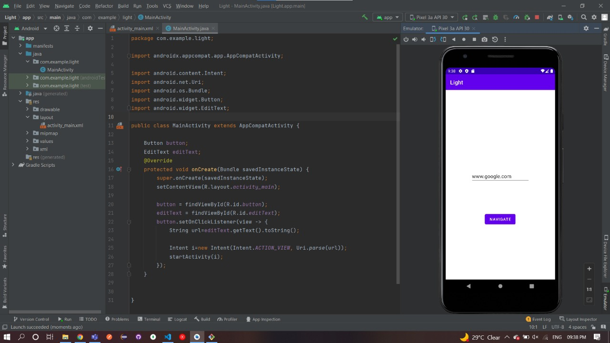

# Ex.No:2a Implicit Intent

Develop program to create a text field and a button “Navigate”. When you enter “www.google.com” and press navigate button it should open google page using Implicit Intents.

## AIM:

To create a layout,click button,open google page using Implicit Intents in Android Studio.

## EQUIPMENTS REQUIRED:

Android Studio(Min. required Artic Fox)

## ALGORITHM:

Step 1: Open Android Stdio and then click on File -> New -> New project.

Step 2: Then type the Application name as ImplicitIntent and click Next.

Step 3: Then select the Minimum SDK as shown below and click Next.

Step 4: Then select the Empty Activity and click Next. Finally click Finish.

Step 5: Design layout in activity_main.xml.

Step 6: open google page using Implicit Intents in MainActivity file.

Step 7: Save and run the application.

## PROGRAM:

```
/*
Program to print the text “Implicit Intent”.
Developed by:Pradeesh S
Registeration Number :212221240038
*/
```

## MainActivity.java:

```
package com.example.light;

import androidx.appcompat.app.AppCompatActivity;

import android.content.Intent;
import android.net.Uri;
import android.os.Bundle;
import android.widget.Button;
import android.widget.EditText;

public class MainActivity extends AppCompatActivity {

    Button button;
    EditText editText;
    @Override
    protected void onCreate(Bundle savedInstanceState) {
        super.onCreate(savedInstanceState);
        setContentView(R.layout.activity_main);

        button = findViewById(R.id.button);
        editText = findViewById(R.id.editText);
        button.setOnClickListener(view -> {
            String url=editText.getText().toString();

            Intent i=new Intent(Intent.ACTION_VIEW, Uri.parse(url));
            startActivity(i);
        });
    }


}
```

## MainActivity.xml:

```
<?xml version="1.0" encoding="utf-8"?>
<androidx.constraintlayout.widget.ConstraintLayout xmlns:android="http://schemas.android.com/apk/res/android"
    xmlns:app="http://schemas.android.com/apk/res-auto"
    xmlns:tools="http://schemas.android.com/tools"
    android:layout_width="match_parent"
    android:layout_height="match_parent"
    tools:context=".MainActivity">

    <Button
        android:id="@+id/button"
        android:layout_width="wrap_content"
        android:layout_height="wrap_content"
        android:layout_marginBottom="192dp"
        android:text="Navigate"
        app:layout_constraintBottom_toBottomOf="parent"
        app:layout_constraintEnd_toEndOf="parent"
        app:layout_constraintHorizontal_bias="0.498"
        app:layout_constraintStart_toStartOf="parent" />

    <EditText
        android:id="@+id/editText"
        android:layout_width="wrap_content"
        android:layout_height="wrap_content"
        android:ems="10"
        android:inputType="textPersonName"
        android:text="Type here"
        app:layout_constraintBottom_toTopOf="@+id/button"
        app:layout_constraintEnd_toEndOf="parent"
        app:layout_constraintHorizontal_bias="0.497"
        app:layout_constraintStart_toStartOf="parent"
        app:layout_constraintTop_toTopOf="parent"
        app:layout_constraintVertical_bias="0.728" />

</androidx.constraintlayout.widget.ConstraintLayout>
```

## OUTPUT



## RESULT

Thus a Simple Android Application to open google page using Implicit Intents using Android Studio is developed and executed successfully.
