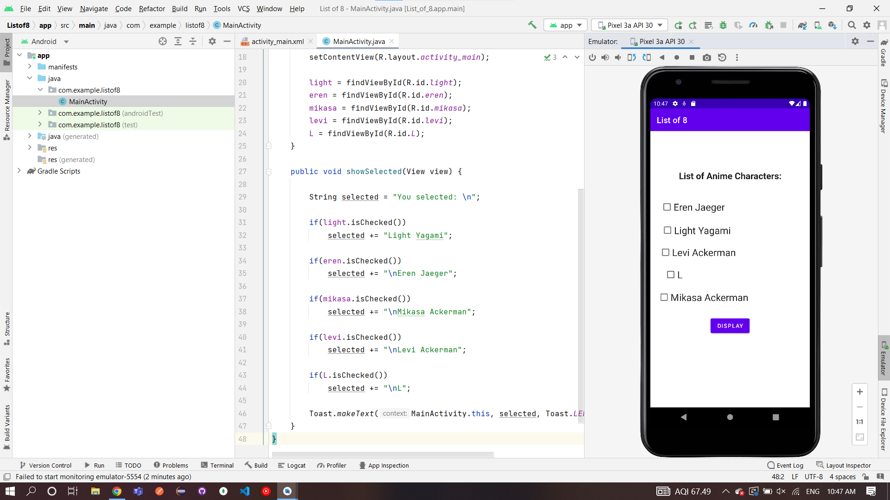
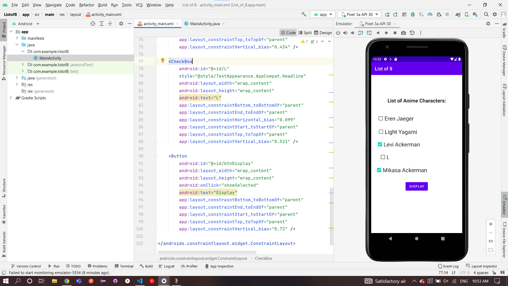
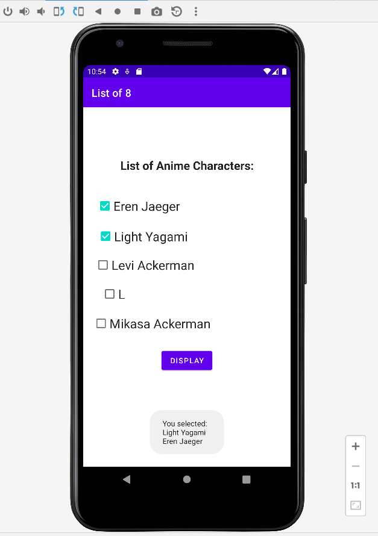

# Ex.No:8 Build a program to show five checkboxes and toast selected checkboxes.

## AIM:

To create a list using checkbox to display selected checkbox item using Android Studio.

## EQUIPMENTS REQUIRED:

Android Studio(Min.required Artic Fox)

## ALGORITHM:

Step 1: Open Android Studio and then click on File -> New -> New project.

Step 2: Then type the Application name as "listofitemselect" and click Next.

Step 3: Then select the Minimum SDK as shown below and click Next.

Step 4: Then select the Empty Activity and click Next. Finally click Finish.

Step 5: Design layout using UI components in activity_main.xml.

Step 6: Display the list using checkbox in MainActivity file.

Step 7: Save and run the application.

## PROGRAM:

```
/*
Program to display check list item”.
Developed by:Pradeesh S
Registeration Number :212221240038
*/
```

## MainActivity.java:

```
package com.example.listof8;

import androidx.appcompat.app.AppCompatActivity;

import android.os.Bundle;
import android.view.View;
import android.widget.CheckBox;
import android.widget.Toast;

public class MainActivity extends AppCompatActivity {

    private CheckBox light, eren, mikasa, levi, L;

    @Override
    public void onCreate(Bundle savedInstanceState) {

        super.onCreate(savedInstanceState);
        setContentView(R.layout.activity_main);

        light = findViewById(R.id.light);
        eren = findViewById(R.id.eren);
        mikasa = findViewById(R.id.mikasa);
        levi = findViewById(R.id.levi);
        L = findViewById(R.id.L);
    }

    public void showSelected(View view) {

        String selected = "You selected: \n";

        if(light.isChecked())
            selected += "Light Yagami";

        if(eren.isChecked())
            selected += "\nEren Jaeger";

        if(mikasa.isChecked())
            selected += "\nMikasa Ackerman";

        if(levi.isChecked())
            selected += "\nLevi Ackerman";

        if(L.isChecked())
            selected += "\nL";

        Toast.makeText(MainActivity.this, selected, Toast.LENGTH_SHORT).show();
    }
}
```

## MainActivity.xml:

```
<?xml version="1.0" encoding="utf-8"?>
<androidx.constraintlayout.widget.ConstraintLayout xmlns:android="http://schemas.android.com/apk/res/android"
    xmlns:app="http://schemas.android.com/apk/res-auto"
    xmlns:tools="http://schemas.android.com/tools"
    android:layout_width="match_parent"
    android:layout_height="match_parent"
    tools:context=".MainActivity">

    <TextView
        android:id="@+id/textView"
        style="@style/TextAppearance.AppCompat.Large"
        android:layout_width="match_parent"
        android:layout_height="wrap_content"
        android:layout_margin="10dp"
        android:gravity="center"
        android:text="List of Anime Characters:"
        android:textStyle="bold"
        app:layout_constraintBottom_toBottomOf="parent"
        app:layout_constraintEnd_toEndOf="parent"
        app:layout_constraintHorizontal_bias="0.157"
        app:layout_constraintStart_toStartOf="parent"
        app:layout_constraintTop_toTopOf="parent"
        app:layout_constraintVertical_bias="0.134" />

    <CheckBox
        android:id="@+id/light"
        style="@style/TextAppearance.AppCompat.Headline"
        android:layout_width="wrap_content"
        android:layout_height="wrap_content"
        android:text="Light Yagami"
        app:layout_constraintBottom_toBottomOf="parent"
        app:layout_constraintEnd_toEndOf="parent"
        app:layout_constraintHorizontal_bias="0.12"
        app:layout_constraintStart_toStartOf="parent"
        app:layout_constraintTop_toTopOf="parent"
        app:layout_constraintVertical_bias="0.348" />

    <CheckBox
        android:id="@+id/eren"
        style="@style/TextAppearance.AppCompat.Headline"
        android:layout_width="wrap_content"
        android:layout_height="wrap_content"
        android:text="Eren Jaeger"
        app:layout_constraintBottom_toBottomOf="parent"
        app:layout_constraintEnd_toEndOf="parent"
        app:layout_constraintHorizontal_bias="0.107"
        app:layout_constraintStart_toStartOf="parent"
        app:layout_constraintTop_toTopOf="parent"
        app:layout_constraintVertical_bias="0.257" />

    <CheckBox
        android:id="@+id/mikasa"
        style="@style/TextAppearance.AppCompat.Headline"
        android:layout_width="wrap_content"
        android:layout_height="wrap_content"
        android:text="Mikasa Ackerman"
        app:layout_constraintBottom_toBottomOf="parent"
        app:layout_constraintEnd_toEndOf="parent"
        app:layout_constraintHorizontal_bias="0.106"
        app:layout_constraintStart_toStartOf="parent"
        app:layout_constraintTop_toTopOf="parent"
        app:layout_constraintVertical_bias="0.609" />

    <CheckBox
        android:id="@+id/levi"
        style="@style/TextAppearance.AppCompat.Headline"
        android:layout_width="wrap_content"
        android:layout_height="wrap_content"
        android:text="Levi Ackerman"
        app:layout_constraintBottom_toBottomOf="parent"
        app:layout_constraintEnd_toEndOf="parent"
        app:layout_constraintHorizontal_bias="0.105"
        app:layout_constraintStart_toStartOf="parent"
        app:layout_constraintTop_toTopOf="parent"
        app:layout_constraintVertical_bias="0.434" />

    <CheckBox
        android:id="@+id/L"
        style="@style/TextAppearance.AppCompat.Headline"
        android:layout_width="wrap_content"
        android:layout_height="wrap_content"
        android:text="L"
        app:layout_constraintBottom_toBottomOf="parent"
        app:layout_constraintEnd_toEndOf="parent"
        app:layout_constraintHorizontal_bias="0.099"
        app:layout_constraintStart_toStartOf="parent"
        app:layout_constraintTop_toTopOf="parent"
        app:layout_constraintVertical_bias="0.521" />

    <Button
        android:id="@+id/btnDisplay"
        android:layout_width="wrap_content"
        android:layout_height="wrap_content"
        android:onClick="showSelected"
        android:text="Display"
        app:layout_constraintBottom_toBottomOf="parent"
        app:layout_constraintEnd_toEndOf="parent"
        app:layout_constraintStart_toStartOf="parent"
        app:layout_constraintTop_toTopOf="parent"
        app:layout_constraintVertical_bias="0.72" />

</androidx.constraintlayout.widget.ConstraintLayout>
```

## OUTPUT






## RESULT

Thus a Simple Android Application create a list using checkbox to display selected checkbox using Android Studio is developed and executed successfully.
