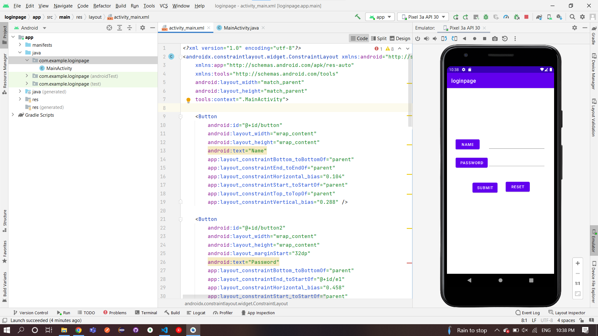

# Ex.No:5 Develop a program to accept username and password from the end user using Text View and Edit Text and display personal information of the student.

## AIM:

To develop a program to accept username and password from the end user using Text View and Edit Text and display personal information of the student using Android Studio.

## EQUIPMENTS REQUIRED:

Android Studio(Min.required Artic Fox)

## ALGORITHM:

Step 1: Open Android Stdio and then click on File -> New -> New project.

Step 2: Then type the Application name as studentinfo and click Next.

Step 3: Then select the Minimum SDK as shown below and click Next.

Step 4: Then select the Empty Activity and click Next. Finally click Finish.

Step 5: Design layout in activity_main.xml.

Step 6: Accept username and password from the end user and the display information give in MainActivity file.

Step 7: Save and run the application.

## PROGRAM:

```
/*
Program to display login page.
Developed by:Pradeesh S
Registeration Number :212221240038
*/
```

## MainActivity.java:

```
package com.example.loginpage;

import androidx.appcompat.app.AppCompatActivity;

import android.os.Bundle;
import android.view.View;
import android.widget.Button;
import android.widget.EditText;
import android.widget.TextView;

public class MainActivity extends AppCompatActivity {

    EditText editName, editPassword;
    TextView result;
    Button buttonSubmit, buttonReset;
    @Override
    protected void onCreate(Bundle savedInstanceState) {
        super.onCreate(savedInstanceState);
        setContentView(R.layout.activity_main);
        editName = (EditText) findViewById(R.id.e1);
        editPassword = (EditText) findViewById(R.id.e2);
        result = (TextView) findViewById(R.id.textView);
        buttonSubmit = (Button) findViewById(R.id.button3);
        buttonReset = (Button) findViewById(R.id.button4);

        buttonSubmit.setOnClickListener(new View.OnClickListener() {
            @Override
            public void onClick(View v) {
                String name = editName.getText().toString();
                String password = editPassword.getText().toString();
                result.setText("Name:\t" + name + "\nPassword:\t" + password );
            }
        });

        buttonReset.setOnClickListener(new View.OnClickListener() {
            @Override
            public void onClick(View v) {
                editName.setText("");
                editPassword.setText("");
                result.setText("");
                editName.requestFocus();
            }
        });
    }
}
```

## MainActivity.xml:

```
<?xml version="1.0" encoding="utf-8"?>
<androidx.constraintlayout.widget.ConstraintLayout xmlns:android="http://schemas.android.com/apk/res/android"
    xmlns:app="http://schemas.android.com/apk/res-auto"
    xmlns:tools="http://schemas.android.com/tools"
    android:layout_width="match_parent"
    android:layout_height="match_parent"
    tools:context=".MainActivity">

    <Button
        android:id="@+id/button"
        android:layout_width="wrap_content"
        android:layout_height="wrap_content"
        android:text="Name"
        app:layout_constraintBottom_toBottomOf="parent"
        app:layout_constraintEnd_toEndOf="parent"
        app:layout_constraintHorizontal_bias="0.104"
        app:layout_constraintStart_toStartOf="parent"
        app:layout_constraintTop_toTopOf="parent"
        app:layout_constraintVertical_bias="0.288" />

    <Button
        android:id="@+id/button2"
        android:layout_width="wrap_content"
        android:layout_height="wrap_content"
        android:layout_marginStart="32dp"
        android:text="Password"
        app:layout_constraintBottom_toBottomOf="parent"
        app:layout_constraintEnd_toStartOf="@+id/e1"
        app:layout_constraintHorizontal_bias="0.458"
        app:layout_constraintStart_toStartOf="parent"
        app:layout_constraintTop_toBottomOf="@+id/button"
        app:layout_constraintVertical_bias="0.047" />

    <Button
        android:id="@+id/button3"
        android:layout_width="wrap_content"
        android:layout_height="wrap_content"
        android:text="Submit"
        app:layout_constraintBottom_toBottomOf="parent"
        app:layout_constraintEnd_toEndOf="parent"
        app:layout_constraintHorizontal_bias="0.312"
        app:layout_constraintStart_toStartOf="parent"
        app:layout_constraintTop_toBottomOf="@+id/button2"
        app:layout_constraintVertical_bias="0.13" />

    <Button
        android:id="@+id/button4"
        android:layout_width="wrap_content"
        android:layout_height="wrap_content"
        android:text="Reset"
        app:layout_constraintBottom_toBottomOf="parent"
        app:layout_constraintEnd_toEndOf="parent"
        app:layout_constraintHorizontal_bias="0.25"
        app:layout_constraintStart_toEndOf="@+id/button3"
        app:layout_constraintTop_toBottomOf="@+id/e1"
        app:layout_constraintVertical_bias="0.267" />

    <EditText
        android:id="@+id/e2"
        android:layout_width="wrap_content"
        android:layout_height="wrap_content"
        android:ems="10"
        android:inputType="textPersonName"
        android:text=""
        app:layout_constraintBottom_toBottomOf="parent"
        app:layout_constraintEnd_toEndOf="parent"
        app:layout_constraintHorizontal_bias="0.825"
        app:layout_constraintStart_toStartOf="parent"
        app:layout_constraintTop_toTopOf="parent"
        app:layout_constraintVertical_bias="0.392" />

    <EditText
        android:id="@+id/e1"
        android:layout_width="wrap_content"
        android:layout_height="wrap_content"
        android:ems="10"
        android:inputType="textPersonName"
        android:text=""
        app:layout_constraintBottom_toBottomOf="parent"
        app:layout_constraintEnd_toEndOf="parent"
        app:layout_constraintHorizontal_bias="0.825"
        app:layout_constraintStart_toStartOf="parent"
        app:layout_constraintTop_toTopOf="parent"
        app:layout_constraintVertical_bias="0.291" />

    <TextView
        android:id="@+id/textView"
        android:layout_width="wrap_content"
        android:layout_height="wrap_content"
        android:text=""
        tools:layout_editor_absoluteX="191dp"
        tools:layout_editor_absoluteY="137dp" />

</androidx.constraintlayout.widget.ConstraintLayout>
```

## OUTPUT




## RESULT

Thus a Simple Android Application develop a program to accept username and password from the end user using Text View and Edit Text and display personal information of the student using Android Studio is developed and executed successfully.
