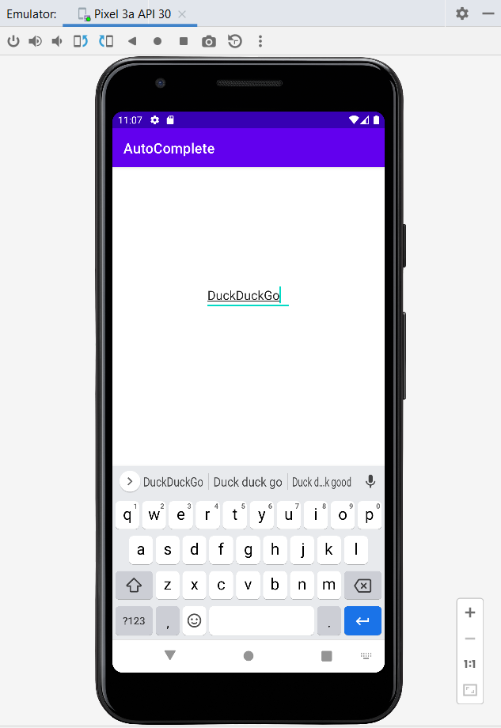

# Ex.No:6 Build a program to create a first display screen of any search engine using Auto Complete Text View.

## AIM:

To develop a program to create a first display screen of any search engine using AutoComplete TextView in Android Studio.

## EQUIPMENTS REQUIRED:

Android Studio(Min.required Artic Fox)

## ALGORITHM:

Step 1: Open Android Stdio and then click on File -> New -> New project.

Step 2: Then type the Application name as searchengine and click Next.

Step 3: Then select the Minimum SDK as shown below and click Next.

Step 4: Then select the Empty Activity and click Next. Finally click Finish.

Step 5: Design layout using AutoComplete TextView in activity_main.xml.

Step 6: Display screen of search engine in MainActivity file.

Step 7: Save and run the application.

## PROGRAM:

```
/*
Program to print the text “display screen of any search engine”.
Developed by:Pradeesh S
Registeration Number :212221240038
*/
```

## MainActivity.java:

```
package com.example.loginpage;

import androidx.appcompat.app.AppCompatActivity;

import android.os.Bundle;
import android.view.View;
import android.widget.Button;
import android.widget.EditText;
import android.widget.TextView;

public class MainActivity extends AppCompatActivity {

    EditText editName, editPassword;
    TextView result;
    Button buttonSubmit, buttonReset;
    @Override
    protected void onCreate(Bundle savedInstanceState) {
        super.onCreate(savedInstanceState);
        setContentView(R.layout.activity_main);
        editName = (EditText) findViewById(R.id.e1);
        editPassword = (EditText) findViewById(R.id.e2);
        result = (TextView) findViewById(R.id.textView);
        buttonSubmit = (Button) findViewById(R.id.button3);
        buttonReset = (Button) findViewById(R.id.button4);

        buttonSubmit.setOnClickListener(new View.OnClickListener() {
            @Override
            public void onClick(View v) {
                String name = editName.getText().toString();
                String password = editPassword.getText().toString();
                result.setText("Name:\t" + name + "\nPassword:\t" + password );
            }
        });

        buttonReset.setOnClickListener(new View.OnClickListener() {
            @Override
            public void onClick(View v) {
                editName.setText("");
                editPassword.setText("");
                result.setText("");
                editName.requestFocus();
            }
        });
    }
}
```

## MainActivity.xml:

```
<?xml version="1.0" encoding="utf-8"?>
<RelativeLayout xmlns:android="http://schemas.android.com/apk/res/android"
    xmlns:tools="http://schemas.android.com/tools"
    android:layout_width="match_parent"
    android:layout_height="match_parent"
    android:background="#32D5D5"
    android:padding="5dp"
    tools:context=".MainActivity">


     <AutoCompleteTextView
        android:id="@+id/autoCompleteTextView1"
        android:layout_width="wrap_content"
        android:layout_height="wrap_content"
        android:text=""
        android:hint="@string/app_name"
        app:layout_constraintBottom_toBottomOf="parent"
        app:layout_constraintEnd_toEndOf="parent"
        app:layout_constraintHorizontal_bias="0.497"
        app:layout_constraintStart_toStartOf="parent"
        app:layout_constraintTop_toTopOf="parent"
        app:layout_constraintVertical_bias="0.255" />

</RelativeLayout>
```

## OUTPUT




## RESULT

Thus a Simple Android Application develop a program to create a first display screen of any search engine using AutoComplete TextView in Android Studio is developed and executed successfully.
